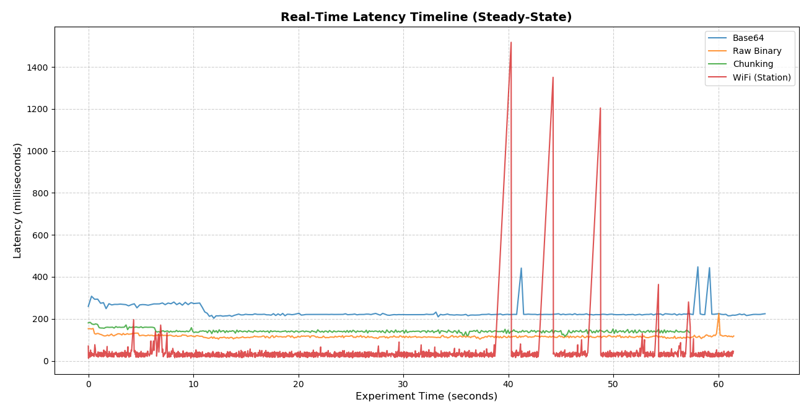
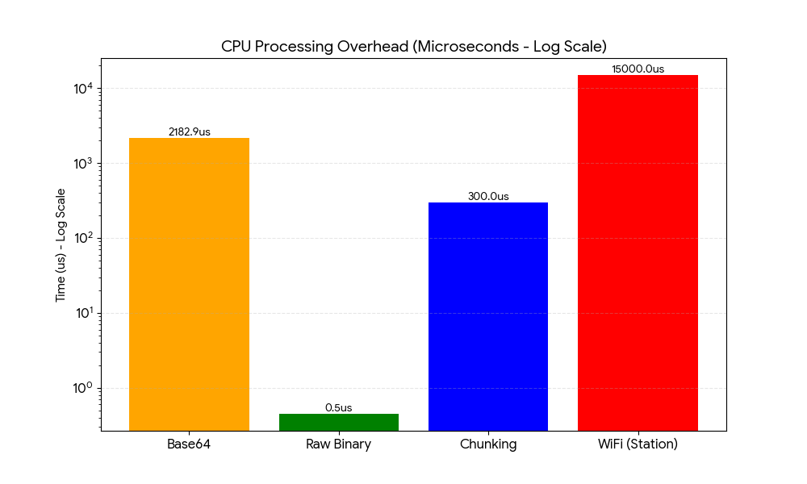

# ESP32-CAM-RealTime-Vision-Benchmark
A comparative study and high-performance implementation of low-latency image transmission protocols (Raw Binary, Chunking, Base64, and WiFi) for autonomous robotics using ESP32-CAM.

## Objective
To find the optimal balance between **latency**, **stability (jitter)**, and **CPU overhead**. In robotics, a low average latency is meaningless if the system suffers from high jitter or consumes all CPU resources on encoding rather than control logic.

## Key Findings

| Transmission Method | Avg Latency | Jitter (Std Dev) | CPU Encoding Time | Verdict |
| :--- | :--- | :--- | :--- | :--- |
| **Raw Binary (Serial)** | **115.8 ms** | **7.5 ms** | **0.45 µs** | **Recommended for Navigation** |
| **Chunking (Serial)** | 141.8 ms | 8.5 ms | ~300 µs | Best for Noisy Environments |
| **Base64 (Serial)** | 230.3 ms | 29.0 ms | 2182.9 µs | Inefficient for High-Speed |
| **WiFi (Station Mode)** | 32.7 ms | 55.6 ms | ~15,000 µs | High Jitter; Unreliable |

### Analysis

* **The Stability Paradox:** While WiFi shows the lowest average latency, it exhibited massive spikes (up to 1.5s). For a robot moving at 1m/s, a 1.5s delay is a blind distance of 1.5 meters.

* **CPU Efficiency:** Moving from Base64 to Raw Binary reduced the CPU encoding "tax" from **2.18ms** to less than **1 microsecond** per frame.
* **Deterministic Serial:** Serial communication at 921,600 baud provided the most stable "beat" for the vision pipeline, essential for velocity estimation algorithms.

## 🛠️ Repository Structure
- `/firmware`: PlatformIO projects for each transmission method.
- `/python_scripts`: High-performance Python receivers with DTR/RTS management.
- `/data`: CSV/Log files from the experiments.
- `/plots`: Latency comparison charts generated during the study.

## Hardware & Environment
- **Controller:** ESP32-CAM (AI Thinker)
- **Baud Rate:** 921,600 bps
- **Resolution:** QVGA (320x240)
- **JPEG Quality:** 12
- **Interface:** FTDI USB-to-Serial (Hardware flow control handled via script)

## Conclusion
For autonomous navigation, **Raw Binary over Serial** is the superior choice. It offers a 50% reduction in latency compared to Base64 and eliminates the catastrophic jitter found in WiFi streams, all while leaving the CPU nearly 100% free for local sensor processing.